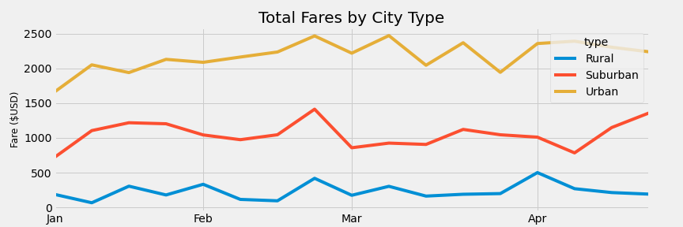

# PyBer_Analysis

## Overview of Analysis:
The purpose of this school district analysis was to go through a multi school data set that included gradings from 15 schools in math and reading for grades 9 to 12. The analysis calculated the means of each math and reading mark per grade and per school. The 9th grade grades were removed for Thomas High School which greatly improved their performance relative to other schools. This was completed by using Panda to code on Jupyter Notebook. 

## Results

### How is the district summary affected?

## Summary
Overall, we can conclude that the 9th graders at Thomas High School are extremely unfit for todays education as their grades significantly impact the entire schools overal passing percentage. It is also fair to say that Thomas High Schoo may be providing a great education as their later grades are doing much better on average compared to the other schools in the dataset. 
